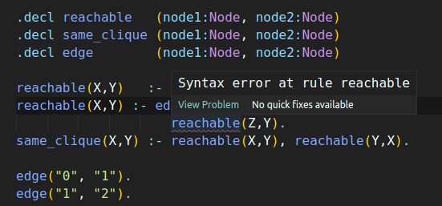
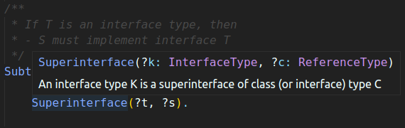
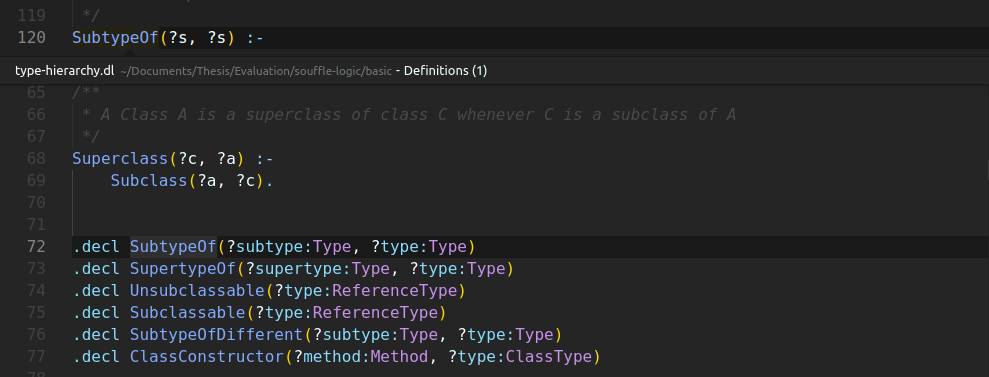
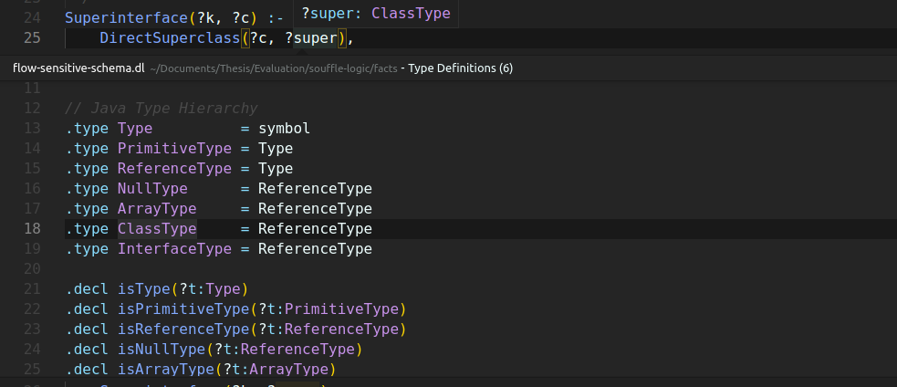
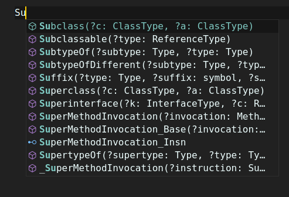
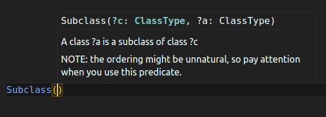
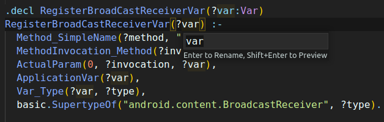
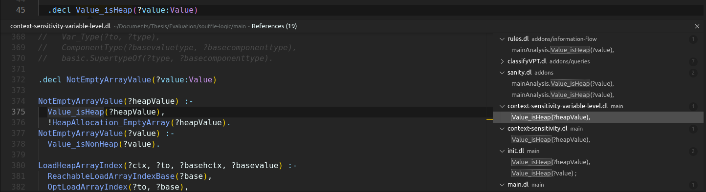
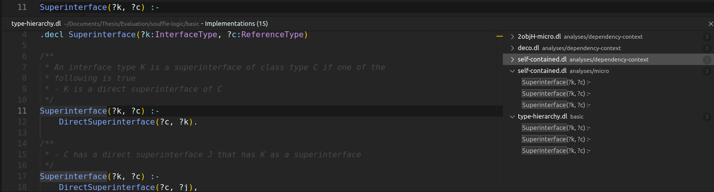
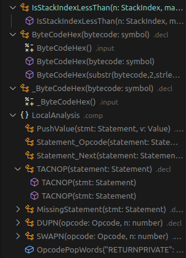

# Soufflé Datalog Language Server README

Soufflé is a logic programming language inspired by Datalog. Soufflé was initially designed for static program analysis and since then, there have been many other applications written in the Soufflé language, including applications in reverse engineering, network analysis and data analytics. 

This is a plugin adding basic smart features to the Soufflé language, using the Language Server Protocol.
## Features

- Syntax error reporting

- Hover (Provide declaration info on hovers)

- Go to definition

- Go to Type Definition

- Autocomplete

- Signature Help

- Rename

- Find all references

- Find all rules for relation

- Document symbols

## Known Issues

In libraries with heavy use of the C preprocessor macros, sometimes parsing fails giving a false syntax error.

## Release Notes

Users appreciate release notes as you update your extension.

### 0.1.0

Initial release of Soufflé Datalog Language Server.
